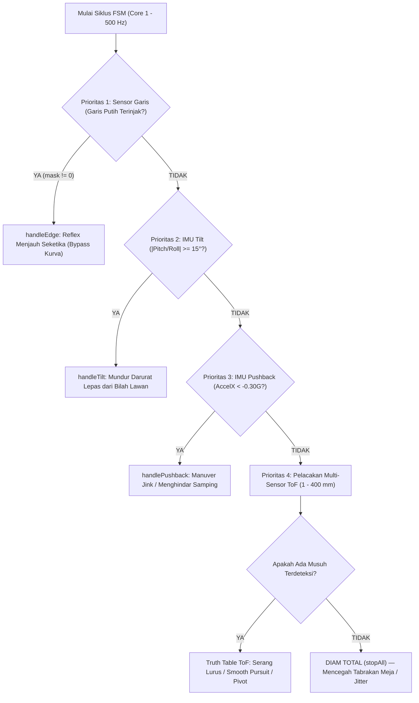
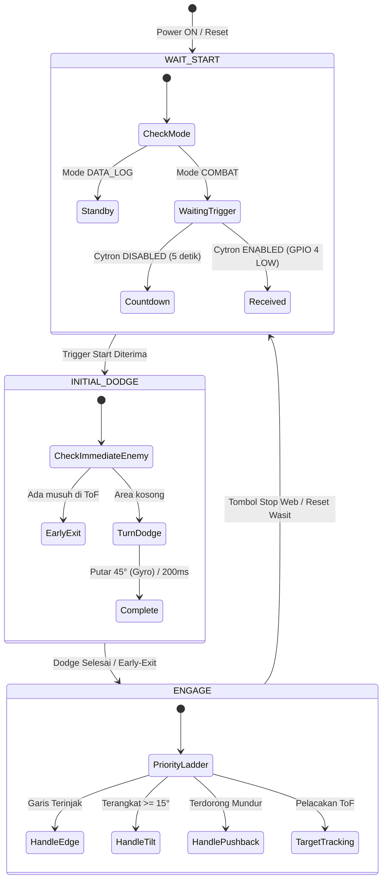

# Logika Operasional & State Machine (Summobot V1)

Dokumen ini merinci **seluruh hierarki pengambilan keputusan, logika reaksi sensor, tahapan state machine (FSM), serta batas-batas numerik (*thresholds*)** yang tertanam di firmware robot autonomous Sumo 500g (**Summobot V1**).

---

## 1. Arsitektur Multi-Tasking & Siklus Eksekusi

Firmware berjalan di atas **ESP32 Dual-Core (FreeRTOS)** dengan pembagian core berikut:

| Core ESP32 | Task / Modul | Frekuensi / Periode | Tugas Utama |
|---|---|:---:|---|
| **Core 1** | **`edgeTask`** | **1000 Hz** (1 ms) | Membaca 4x sensor garis IR arena (FL, FR, BL, BR) dengan prioritas instan. |
| **Core 1** | **`fsmTask`** | **500 Hz** (2 ms) | Otak utama pengambilan keputusan robot (evaluasi reflex garis, kemiringan, dorongan, dan pelacakan musuh). |
| **Core 1** | **`motorTask`** | **200 Hz** (5 ms) | Penggerak PWM motor LEDC (20 kHz) dan eksekusi kurva akselerasi *anti-jengat* (*slew rate limiter*). |
| **Core 0** | **`tofTask`** | **100 Hz** (10 ms) | Polling data 6x sensor jarak ToF VL53L1X pada bus ganda I2C0 & I2C1. |
| **Core 0** | **`imuTask`** | **100 Hz** (10 ms) | Pembacaan akselerometer & giroskop MPU6050 pada I2C1 (komputasi sudut Pitch, Roll, Yaw/Heading). |
| **Core 0** | **`bleTask`** | **20 Hz** (50 ms) | Komunikasi nirkabel Web Bluetooth & Web Serial untuk telemetry studio dan tuning parameter. |

---

## 2. Hierarki Prioritas Keputusan (Priority Ladder)

Di dalam loop pertempuran (`ENGAGE`), `fsmTask` mengevaluasi kondisi sensor secara berurutan dari **Prioritas 1 (tertinggi)** ke **Prioritas 4 (terendah)**. Jika suatu prioritas terpicu, logika di bawahnya **tidak akan dieksekusi**:

---

## 3. Detail Logika Tiap Kondisi & Reaksinya

### 🚨 Prioritas 1: Reflex Sensor Garis Arena (`handleEdge()`)
* **Pemicu:** Sensor garis mendeteksi garis putih pembatas Dohyo (Active-LOW, logika `0`).
* **Sifat Reaksi:** **Bypass Kurva Akselerasi (`setImmediate`)** — Kecepatan motor melompat instan tanpa jeda ramp untuk mencegah robot terlempar keluar arena (*ring-out*).

| Bitmask IR | Sensor Terpicu | Arah Manuver Robot | Kecepatan Motor Kiri / Kanan | Durasi Tahan |
|:---:|:---:|---|:---:|:---:|
| `0b0011` | **FL + FR** (Depan Kiri & Kanan) | **Mundur Lurus Penuh** menjauhi garis | `-edgeBackup` / `-edgeBackup` | **90 ms** |
| `0b0101` | **FL + BL** (Sisi Kiri Penuh) | **Pivot Kanan** menjauh ke tengah | `+edgeEvade` / `-(edgeEvade * 2/3)` | **90 ms** |
| `0b0110` | **FR + BR** (Sisi Kanan Penuh) | **Pivot Kiri** menjauh ke tengah | `-(edgeEvade * 2/3)` / `+edgeEvade` | **90 ms** |
| `0b0001` | **FL** (Hanya Depan-Kiri) | **Mundur Serong Kanan** | `-edgeBackup` / `-(edgeBackup / 2)` | **80 ms** |
| `0b0010` | **FR** (Hanya Depan-Kanan) | **Mundur Serong Kiri** | `-(edgeBackup / 2)` / `-edgeBackup` | **80 ms** |
| `0b0100` | **BL** (Hanya Belakang-Kiri) | **Maju Serong Kanan** | `+edgeEvade` / `+(edgeEvade / 2)` | **80 ms** |
| `0b1000` | **BR** (Hanya Belakang-Kanan) | **Maju Serong Kiri** | `+(edgeEvade / 2)` / `+edgeEvade` | **80 ms** |
| Kombinasi Lain | Tiga / Empat Sensor | **Mundur Darurat Penuh** | `-edgeBackup` / `-edgeBackup` | **80 ms** |

> Begitu garis lepas (`mask == 0`), kontrol langsung dialihkan kembali ke pelacakan target ToF pada frame berikutnya.

---

### 🛡️ Prioritas 2: Proteksi Terjungkal / Terangkat (`handleTilt()`)
* **Prasyarat:** `HAS_IMU = 1` dan Gyro diaktifkan di konfigurasi NVS (`isGyroEnabled() == true`).
* **Pemicu:** 
  $$|\text{Pitch}| \ge 15.0^\circ \quad \text{atau} \quad |\text{Roll}| \ge 15.0^\circ$$
* **Penyebab Fisik:** Bagian depan robot terungkit bilah/scoop lawan, atau robot terbalik.
* **Tindakan:** Motor diperintahkan **Mundur Penuh (`-tiltEscape`)** pada kedua roda secara bersamaan untuk meloloskan sasis dari bilah lawan sebelum roda kehilangan traksi.

---

### 💥 Prioritas 3: Deteksi Terdorong Mundur Saat Adu Dorong (`handlePushback()`)
* **Prasyarat:** `HAS_IMU = 1` dan Gyro diaktifkan (`isGyroEnabled() == true`).
* **Pemicu:** 
  $$\text{Accel}_X < -0.30\text{ G}$$
* **Penyebab Fisik:** Kedua robot terkunci dalam adu dorong frontal (*head-on stalemate*), dan robot kita kalah tenaga dorong sehingga terseret mundur.
* **Tindakan (Manuver Jink / Slip-Out):**
  - Motor Kiri: `+pushbackJink`
  - Motor Kanan: `-(pushbackJink * 2/3)`
  - Durasi tahan: **150 ms**
  - **Efek:** Robot memuntir ke samping (*side-jink*) untuk keluar dari garis dorong lawan dan mencari celah flank samping musuh.

---

### 🎯 Prioritas 4: Pelacakan Target Multi-Sensor ToF (`executeTargetTracking()`)
* **Batas Jangkauan Deteksi:**
  $$1\text{ mm} \le \text{Jarak} \le 400\text{ mm} \quad (\text{Target di luar 40 cm diabaikan})$$

#### A. Tabel Kebenaran 3 Sensor Depan (FL, FC, FR):

| Sensor FL | Sensor FC | Sensor FR | Interpretasi Posisi Lawan | Tindakan Motor | Perilaku Gerak |
|:---:|:---:|:---:|---|---|---|
| ❌ | **✅** | ❌ | Lawan tepat di tengah | **L: `attackFull`, R: `attackFull`** | Maju lurus serbu penuh |
| **✅** | **✅** | **✅** | Lawan frontal mengunci penuh | **L: `attackFull`, R: `attackFull`** | Maju lurus serbu penuh |
| **✅** | ❌ | **✅** | Lawan frontal simetris | **L: `attackFull`, R: `attackFull`** | Maju lurus serbu penuh |
| **✅** | **✅** | ❌ | Lawan agak condong ke kiri | **L: `attackInner`, R: `attackOuter`** | **Smooth Pursuit Curve (Belok kiri halus)** |
| ❌ | **✅** | **✅** | Lawan agak condong ke kanan | **L: `attackOuter`, R: `attackInner`** | **Smooth Pursuit Curve (Belok kanan halus)** |
| **✅** | ❌ | ❌ | Lawan di sudut serong kiri | **L: `-turnInPlace`, R: `+turnInPlace`** | Pivot cepat putar kiri di tempat |
| ❌ | ❌ | **✅** | Lawan di sudut serong kanan | **L: `+turnInPlace`, R: `-turnInPlace`** | Pivot cepat putar kanan di tempat |

> **Konsep Smooth Pursuit Curve:** Saat belok mengejar lawan (misal serong kiri), roda dalam tetap berputar maju positif (`attackInner`), bukan mundur. Hal ini menjaga momentum inersia robot tetap tinggi dan mencegah robot melambat saat bermanuver.

#### B. Sensor Samping & Belakang (ML, MR, RR):
Jika ketiga sensor depan tidak mendeteksi objek, robot mengecek sensor ekspansi:

| Sensor Terdekat | Posisi Ancaman | Tindakan Motor |
|:---:|---|---|
| **`ML`** (Mid-Left) | Flank Kiri | **L: `-turnInPlace`, R: `+turnInPlace`** (Putar kiri menghadap lawan) |
| **`MR`** (Mid-Right) | Flank Kanan | **L: `+turnInPlace`, R: `-turnInPlace`** (Putar kanan menghadap lawan) |
| **`RR`** (Rear) | Bokong / Belakang | Putar balik 180° ke arah putaran terakhir (`lastTurnDir`) |

#### C. Kondisi Tidak Ada Musuh (Ruang Kosong / Diam):
* Jika tidak ada satupun ToF yang mendeteksi objek dalam radius 1–400 mm:
  $$\text{Motor Kiri} = 0, \quad \text{Motor Kanan} = 0 \quad (\text{DIAM TOTAL})$$
* **Tujuan Desain:** Mencegah robot liar berputar-putar tanpa kendali saat sesi uji coba meja, menghilangkan getaran berlebih (*chattering*), dan menghemat konsumsi daya baterai.

---

## 4. State Machine Utama (FSM Pertandingan)

### 1. `WAIT_START` (Menunggu Aba-aba Wasit)
* Semua motor mati (`stopAll(true)`).
* **Jika Cytron IR Start Aktif:** Menunggu sinyal pulsa Active-LOW pada **GPIO 4** (debounced 20 ms). Begitu sinyal remote wasit masuk, robot seketika beralih ke `INITIAL_DODGE`.
* **Jika Cytron Dinonaktifkan:** Sistem menjalankan hitung mundur 5 detik secara otomatis (indikasi countdown dikirim ke serial monitor). Setelah 5000 ms, robot langsung meluncur.

### 2. `INITIAL_DODGE` (Manuver Menghindar Awal)
* **Tujuan:** Menghindari serangan tabrakan lurus frontal dari robot musuh yang menggunakan start sergap.
* **Deteksi Musuh Dini (*Early-Exit*):** Jika saat start musuh sudah langsung berada di depan ToF mana pun, manuver dodge dibatalkan seketika (*early-exit*) dan langsung masuk ke `ENGAGE` untuk menyerang.
* **Manuver Mengelak:**
  - Jika Gyro aktif: Belok serong hingga selisih sudut heading mencapai **$45^\circ$** (`std::abs(turned) < 45.0f`).
  - Jika Gyro nonaktif: Belok serong selama **200 ms**.
  - Kecepatan motor: Kiri = `dodgeOuter`, Kanan = `dodgeInner`.

### 3. `ENGAGE` (Pertarungan Penuh)
* Siklus loop berjalan pada **500 Hz**.
* Menjalankan evaluasi berjenjang (Prioritas 1 s/d 4) secara terus-menerus hingga wasit menekan tombol remote stop atau perintah stop diterima dari Web Dashboard.

---

## 5. Kurva Akselerasi & Anti-Jengat (Slew Rate Limiter)

Untuk mencegah robot *jengat* (roda depan terangkat / *wheelie*) saat akselerasi mendadak dari diam ke kecepatan tinggi, `motorhw::updateRamp()` membatasi lonjakan PWM:

$$\Delta\text{PWM}_{\text{maks}} = \text{accelRate} \quad (\text{per } 5\text{ ms})$$

* **Pengecualian Khusus (Reflex Garis):**
  Saat `handleEdge()` aktif, fungsi `setImmediate()` digunakan untuk melewati (*bypass*) kurva akselerasi ini, sehingga pengereman dan pembalikan arah motor terjadi **tanpa penundaan (0 ms delay)** demi menyelamatkan robot dari tepi garis arena.

---

## 6. Batas-Batas Numerik (Thresholds Reference Table)

| Parameter | Nilai / Rentang | Keterangan Teknis |
|---|:---:|---|
| **Rentang Deteksi Musuh** | **1 mm – 400 mm** | Nilai ToF di luar batas ini dianggap ruang kosong (*no target*). |
| **Batas Sudut Miring (Tilt)** | **$\pm 15.0^\circ$** | Memicu mundur darurat saat robot terangkat bilah musuh. |
| **Ambang Hentakan Mundur** | **$-0.30\text{ G}$** | Memicu gerakan jink/slip-out saat adu dorong terseret mundur. |
| **Frekuensi PWM Motor** | **20.000 Hz (20 kHz)** | Modulasi LEDC ultrasonik (senyap, bebas dengung magnetik). |
| **Resolusi Duty Cycle** | **8-Bit (0 – 255)** | Nilai 255 setara dengan 100% tegangan baterai penuh. |
| **Debounce Remote Cytron** | **20 ms** | Menyaring noise kelistrikan dan pantulan sinyal remote. |
| **Sudut Dodge Awal** | **$45.0^\circ$** | Belokan pembuka arena berbasis MPU6050 Heading. |
| **Timeout Dodge (No Gyro)**| **200 ms** | Durasi fallback manuver dodge saat IMU nonaktif. |
| **Durasi Tahan Mundur Garis**| **80 – 90 ms** | Waktu minimum motor membalas arah saat menyentuh garis putih. |
| **ToF Timing Budget** | **20 ms (20.000 µs)** | Durasi pemaparan foton laser per frame pengukuran. |
| **ToF Inter-Measurement** | **28 ms** | Jeda antar pembacaan ToF ($\ge \text{Timing Budget} + 4\text{ms}$). |
| **ToF Polling Task Delay** | **10 ms** | Frekuensi polling loop `tofTask` membaca kesiapan `dataReady()`. |

---

## 7. Komparasi Profil Parameter Kecepatan (TEST vs COMPETITION)

| Parameter Profil | Mode TEST *(Aman / Meja)* | Mode COMPETITION *(Lomba)* | Fungsi & Kegunaan |
|---|:---:|:---:|---|
| **`attackFull`** | **55** (~21%) | **255** (100%) | Maju lurus sergap frontal saat musuh di tengah. |
| **`attackOuter`** | **50** (~19%) | **230** (~90%) | Kecepatan roda luar saat pursuit curve serong mengejar musuh. |
| **`attackInner`** | **45** (~18%) | **160** (~63%) | Kecepatan roda dalam saat pursuit curve serong. |
| **`turnInPlace`** | **90** (~35%) | **180** (~70%) | Putar balik di tempat saat musuh mendadak di samping/serong. |
| **`searchSpin`** | **45** (~17%) | **100** (~39%) | Kecepatan jelajah rotasi saat mencari jejak lawan. |
| **`dodgeOuter`** | **60** (~23%) | **180** (~70%) | Roda luar saat manuver start mengelak awal. |
| **`dodgeInner`** | **-30** (~-12%) | **-70** (~-27%) | Roda dalam saat manuver start mengelak awal. |
| **`edgeBackup`** | **80** (~31%) | **230** (~90%) | Kecepatan reflex mundur instan dari garis putih arena. |
| **`edgeEvade`** | **70** (~27%) | **190** (~75%) | Kecepatan reflex belok serong menjauhi sudut dohyo. |
| **`tiltEscape`** | **90** (~35%) | **255** (100%) | Daya dorong mundur saat sasis terungkit $\ge 15^\circ$. |
| **`rearThreat`** | **70** (~27%) | **255** (100%) | Reaksi sergap saat sensor belakang mengunci lawan. |
| **`sideEvade`** | **60** (~23%) | **180** (~70%) | Reaksi putar badan saat sisi samping diserang. |
| **`pushbackJink`** | **70** (~27%) | **210** (~82%) | Reaksi pelepasan slip-out saat adu dorong terseret $\ge 0.30\text{G}$. |
| **`accelRate`** | **18** / 5ms | **40** / 5ms | Laju ramp akselerasi anti-jengat (*slew rate limiter*). |
